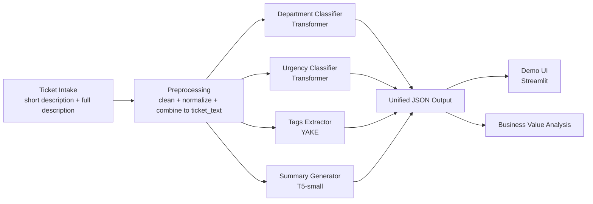

# IT Ticket Triage NLP System

An end-to-end NLP project for automated IT ticket triage.

The system predicts:
- routing department
- urgency/priority
- key tags
- short summary

It is built with a training notebook first, then packaged into a Streamlit app for live demo and product-style usage.

## Objective

Manual ticket triage is slow, inconsistent, and expensive at scale. This project automates first-pass triage using NLP so support teams can:
- reduce time-to-first-action
- reduce misroutes
- standardize triage decisions
- estimate business savings from automation

## Target Architecture (E2E)



## JSON Output Schema

```json
{
  "ticket_id": "...",
  "department": {"label": "...", "confidence": 0.92},
  "urgency": {"label": "...", "confidence": 0.81},
  "tags": ["vpn", "login", "timeout"],
  "summary": "User cannot connect to VPN after password reset."
}
```

## What Was Implemented

### 1) Data Pipeline
- Raw data ingestion from `data/raw/IT Support Ticket Data.csv`
- Stratified subset generation script:
  - `scripts/create_stratified_subset.py`
  - default output: `data/processed/IT Support Ticket Data.stratified_3000.csv`
- Stratified train/val/test split with leakage guard by ticket id

### 2) Text Preprocessing
- HTML stripping
- URL/email removal
- whitespace normalization
- conservative boilerplate cleanup (headers/signoff/disclaimer handling)
- stable `ticket_text` field used across all tasks

### 3) Label Standardization
- Department alias normalization (example: `billing & payments` -> `Billing and Payments`)
- Urgency alias normalization (example: `high priority` -> `high`)
- Mapping persistence (`label2id`, `id2label`) for reproducible inference

### 4) Multi-Approach Modeling
- Baseline: TF-IDF + Logistic Regression (department + urgency)
- Transformer classifiers with Hugging Face `Trainer`
- Candidate comparison framework for model and learning-rate trials
- Early stopping support
- Final model export under:
  - `models/department_model/best`
  - `models/urgency_model/best`

### 5) Tags + Summary Module
- Tags: YAKE keyphrase extraction (fast and robust)
- Summary: `t5-small` abstractive summary (optional toggle in app)

### 6) Unified Inference + Demo App
- Shared runtime engine: `app/triage_engine.py`
- Streamlit UI: `app/main.py`
- Single-call inference: `triage_ticket(...)`

## What Was Tested / Compared

- Baseline vs Transformer for both tasks (department + urgency)
- Candidate trials with configurable learning rates and epochs
- Inference smoke tests using saved model checkpoints
- End-to-end demo path: input ticket -> JSON output

Evaluation artifacts are written under `results/` and include metrics, predictions, and model-selection outputs.

## Repository Layout

```text
NLP-IT-Ticket_Triage/
  app/
    main.py
    triage_engine.py
  data/
    raw/
    processed/
  docs/
  models/
    department_model/
    urgency_model/
  notebooks/
    01_training_and_eval.ipynb
  results/
  scripts/
    create_stratified_subset.py
  requirements.txt
```

## Setup (Clone and Run)

### 1) Clone

```bash
git clone <your-repo-url>
cd NLP-IT-Ticket_Triage
```

### 2) Create and activate virtual environment

```bash
python3 -m venv .venv
source .venv/bin/activate
```

### 3) Install dependencies

```bash
python -m pip install --upgrade pip
python -m pip install -r requirements.txt
```

### 4) Prepare data subset (optional but recommended)

```bash
python scripts/create_stratified_subset.py
```

This creates `data/processed/IT Support Ticket Data.stratified_3000.csv` with stratification.

### 5) Train/Evaluate in notebook

```bash
jupyter notebook notebooks/01_training_and_eval.ipynb
```

Run cells top-to-bottom to produce model checkpoints and metrics.

### 6) Launch Streamlit app

```bash
python -m streamlit run app/main.py
```

Open the local URL shown by Streamlit (typically `http://localhost:8501`).

## Notes on First Run Downloads

The first execution may download model weights from Hugging Face:
- classifiers/tokenizers if checkpoint fallback is used
- `t5-small` summarizer (if summary is enabled)

After first download, models are cached and startup is faster.

## Common Troubleshooting

### `ModuleNotFoundError: No module named 'yake'`

Usually means Streamlit is running outside your project venv.

Use:

```bash
source .venv/bin/activate
python -m pip install -r requirements.txt
python -m streamlit run app/main.py
```

### Streamlit opens but wrong environment is used

Always launch with module form:

```bash
python -m streamlit run app/main.py
```

This guarantees the same interpreter as your active venv.

## Current Status

- Notebook pipeline is implemented and runnable locally.
- Streamlit app is implemented and connected to trained model outputs.
- Project is ready for iterative tuning and final presentation packaging.
